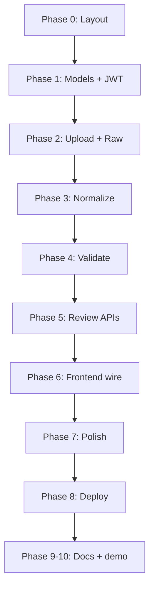

# Breathe ESG — Implementation Plan

> **Purpose:** Step-by-step execution plan for the internship prototype (emissions data ingestion & review platform).  
> **Source of truth for requirements:** [`product.md`](./product.md)  
> **Last updated:** 2026-05-24

---

## Definition of done

The prototype is **complete** when all of the following are true:

- [x] Upload works for all three source types (`sap`, `utility`, `travel`) via API
- [x] Raw source rows are preserved immutably in JSONB (`RawRecord`)
- [x] Normalized records exist with correct scope, units, and ISO dates
- [x] Hard failures and soft flags match PRD validation scenarios
- [x] Analyst can PATCH normalized fields; each change writes an `AuditLog` entry
- [x] Approve sets `locked_for_audit`; further edits return 403
- [x] Frontend demo path uses the real API (not mocks)
- [ ] Deployed: backend + database + frontend with public URLs (config ready; deploy to your accounts)
- [x] Documentation: `MODEL.md`, `DECISIONS.md`, `TRADEOFFS.md`, `SOURCES.md`, `README.md`

**Non-goals (do not build):** Live SAP integration, OCR, SSO, complex RBAC, async workers, ML validation, full emissions engine, full ESG reporting suite.

---

## Current baseline

| Area | Status |
|------|--------|
| Frontend shell | Done — React + Vite + React Router, pages: Dashboard, Upload, Review, Audit, Sources, Settings |
| UI components | Done — `AppShell`, `RecordDrawer` (raw / normalized / history tabs), `StatusPill`, tables |
| Data | Live API only — no mock data module |
| Backend | **Phase 1 done** — [`../breathe-esg-be`](../breathe-esg-be) (Django models, JWT, API skeleton) |
| Sample CSVs | **Not started** |
| Required docs | Only `product.md` exists |
| Deployment | **Not started** |

**Stack note:** PRD lists Axios, Zustand, TanStack Table. Current app uses React Query (acceptable for server state). Add Axios for HTTP; tables can stay custom or adopt TanStack Table later.

---

## Repository layout (target)

```txt
assigment/
├── breathe-esg-be/          # Django + DRF
│   ├── config/
│   ├── apps/ (organizations, ingestion, records, audit)
│   ├── samples/
│   └── manage.py
├── breathe-esg-fe/          # React frontend
│   └── src/
├── samples/                 # (in breathe-esg-be/samples/)
│   ├── sap_fuel.csv
│   ├── utility_electricity.csv
│   └── travel.csv
├── PLAN.md                  # This file
├── product.md
├── MODEL.md                 # To write
├── DECISIONS.md             # To write
├── TRADEOFFS.md              # To write
├── SOURCES.md                # To write
└── README.md                 # To write
```

---

## Guiding principles

1. **Vertical slices** — Each milestone must work end-to-end (upload → review → edit → approve → audit).
2. **Raw is sacred** — Never mutate `RawRecord.raw_payload`; edits only on `NormalizedEmissionRecord`.
3. **Rules, not ML** — Validation = explicit hard/soft rules from PRD §7.5 and §12.
4. **Multi-tenant in schema, single org in demo** — `organization_id` on all tenant data from day one; seed one org for demos.
5. **Sample CSVs are part of the deliverable** — Messy, realistic fixtures + document in `SOURCES.md`.

---

## Architecture (pipeline)

```txt
Client Upload (CSV)
        ↓
Ingestion Layer          → DataSource + RawRecord (JSONB)
        ↓
Normalization Engine     → NormalizedEmissionRecord (canonical fields + scope)
        ↓
Validation Engine        → FAILED | FLAGGED | PENDING
        ↓
Analyst Review (API + UI)
        ↓
Approve / Reject         → AuditLog on edits; lock on approve
```

---

## Phase 0 — Scope & layout (½ day)

| Step | Task |
|------|------|
| 0.1 | Create `backend/` and `samples/` folders |
| 0.2 | Add root `README.md` stub with planned env vars |
| 0.3 | Confirm frontend routes match PRD: Dashboard, Upload, Review, Audit (Sources/Settings optional) |
| 0.4 | Copy Definition of Done checklist into tracking (this file) |

**Exit:** Folder structure exists; team agrees on DoD.

---

## Phase 1 — Backend foundation (Day 1)

### 1.1 Bootstrap Django

- [ ] `requirements.txt`: django, djangorestframework, psycopg2-binary, django-cors-headers, djangorestframework-simplejwt, pandas, python-dotenv
- [ ] Project `config/`, `manage.py`, `.env.example`
- [ ] PostgreSQL locally (Docker or local install)

### 1.2 Data models (PRD §8)

| Model | Key points |
|-------|------------|
| `Organization` | `id`, `name`, `created_at` |
| `DataSource` | `organization`, `source_type`, `filename`, `uploaded_by`, `uploaded_at`, `processing_status`, row counts |
| `RawRecord` | `datasource`, `row_number`, `raw_payload` (JSONB), `processing_status`, `error_message` |
| `NormalizedEmissionRecord` | FK raw + org; category, scope, dates, units, status, reviewer, `locked_for_audit` |
| `AuditLog` | `record`, `field_name`, `old_value`, `new_value`, `changed_by`, `changed_at` |

- [ ] Migrations applied
- [ ] DB indexes: `(organization_id, status)`, `datasource_id`, `raw_record_id`

### 1.3 Auth & tenancy

- [ ] SimpleJWT login (`POST /api/auth/token/`)
- [ ] Seed user + organization
- [ ] All record querysets scoped by organization (no cross-tenant reads)
- [ ] CORS for `http://localhost:5173`

### 1.4 API skeleton (empty logic OK)

| Method | Path | Purpose |
|--------|------|---------|
| POST | `/api/uploads/` | Multipart upload |
| GET | `/api/records/` | List + filters + pagination |
| GET | `/api/records/:id/` | Detail |
| PATCH | `/api/records/:id/` | Edit normalized fields |
| POST | `/api/records/:id/approve/` | Approve + lock |
| POST | `/api/records/:id/reject/` | Reject |
| GET | `/api/audit/:record_id/` | Field-level history |

**Exit:** JWT works; migrations clean; empty list returns 200.

---

## Phase 2 — Ingestion & sample data (Day 2 AM)

### 2.1 Sample CSV fixtures (`samples/`)

| File | Deliberate edge cases |
|------|------------------------|
| `sap_fuel.csv` | Alternate column names, mixed date formats, L/gal/kg, unknown unit, invalid plant code |
| `utility_electricity.csv` | kWh + MWh, negative row, usage spike, meter IDs |
| `travel.csv` | Missing airport, unrealistic distance, flight/hotel/taxi mix |

- [ ] 50–200 rows per file for dev; optional 1k+ row file for perf smoke test
- [ ] Document fabrication in `SOURCES.md` (start notes during creation)

### 2.2 Upload implementation

- [ ] `POST /api/uploads/`: `file`, `source_type`, `organization_id`
- [ ] Validate CSV only; size limit (~5k rows target)
- [ ] Parse with pandas; store each row as `RawRecord.raw_payload`
- [ ] Create `DataSource` with `processing_status` lifecycle
- [ ] Response: `{ datasource_id, total, failed_parse_count, ... }`

**Exit:** Upload SAP file → N raw rows in DB; payloads match original columns.

---

## Phase 3 — Normalization (Day 2 PM)

### 3.1 Module structure

```txt
backend/apps/normalization/
├── base.py       # Canonical shape / shared helpers
├── sap.py
├── utility.py
├── travel.py
└── pipeline.py   # run after upload
```

### 3.2 Rules per source

| Source | Mapping examples | Scope |
|--------|------------------|-------|
| SAP | `Menge→quantity`, `Einheit→unit`, `Werk→facility_code`, dates→ISO, gal→L | Scope 1 |
| Utility | billing dates, MWh→kWh, meter→facility lookup | Scope 2 |
| Travel | airport codes→distance estimate, `transport_mode` | Scope 3 |

- [ ] Header aliases (case-insensitive)
- [ ] Date parsers: `DD.MM.YYYY`, `YYYY-MM-DD`, `MM/DD/YYYY`
- [ ] Optional simple `emission_factor` constants (document assumptions)

### 3.3 Pipeline

- [ ] `normalize_datasource(datasource_id)` after raw insert
- [ ] One `NormalizedEmissionRecord` per successful raw row
- [ ] Parse/normalize failures recorded on raw or normalized with message

**Exit:** All three sample files produce normalized rows with correct scope.

---

## Phase 4 — Validation (Day 2 end)

### 4.1 Hard vs soft

| Severity | Record status | Examples |
|----------|---------------|----------|
| Hard | `FAILED` | Missing required field, invalid date, unsupported unit, negative consumption, missing airport |
| Soft | `FLAGGED` | Usage spike, unknown plant, unrealistic travel distance, missing emission factor |

Store issues as JSON on record, e.g. `validation_issues: [{ code, severity, message }]`.

### 4.2 PRD scenario matrix (minimum)

| Source | Scenario | Action |
|--------|----------|--------|
| SAP | Unknown unit | FAIL |
| SAP | Invalid plant | FLAG |
| Utility | Negative kWh | FAIL |
| Utility | High usage | FLAG |
| Travel | Missing airport | FAIL |
| Travel | Unrealistic distance | FLAG |

- [ ] Update `DataSource` aggregates: processed / failed / flagged counts

**Exit:** Bad rows land in correct status; API detail includes `validation_issues`.

---

## Phase 5 — Review & audit APIs (Day 3 AM)

### 5.1 PATCH

- [ ] Whitelist editable normalized fields only
- [ ] Write `AuditLog` per changed field (old/new, user, timestamp)
- [ ] Reject PATCH when `locked_for_audit=True` → 403

### 5.2 Approve / reject

- [ ] **Approve:** `status=APPROVED`, `locked_for_audit=True`, reviewer + timestamp
- [ ] **Reject:** `status=REJECTED` (document whether reject locks or not in `DECISIONS.md`)

### 5.3 Detail serializer

`GET /api/records/:id/` returns:

- `raw` (from `RawRecord.raw_payload`)
- `normalized`
- `validation_issues`
- `audit_history`
- `locked_for_audit`

**Exit:** Postman: edit → audit entry → approve → PATCH blocked.

---

## Phase 6 — Frontend integration (Day 3 PM)

### 6.1 API client

- [ ] Add `axios`; `src/services/api.ts` with `VITE_API_URL`
- [ ] JWT storage + attach `Authorization` header
- [ ] React Query hooks: `useRecords`, `useRecord`, `useUpload`, `usePatchRecord`, `useApprove`, `useReject`, `useAuditLog`

### 6.2 Page wiring

| Page | Work |
|------|------|
| Upload | Real `FormData` POST; show API summary; remove fake default file state |
| Dashboard | Stats from API or derived counts |
| Review | List from API; filters as query params; drawer loads by id |
| RecordDrawer | PATCH save; approve/reject; audit tab from API |
| Audit | Global or per-record feed from API |

- [ ] Optional: route `/app/review/:id` for deep links

**Exit:** Full demo without Django admin.

---

## Phase 7 — UX polish (Day 3 evening)

- [ ] Pagination on review table
- [ ] Loading skeletons + error toasts
- [ ] Sidebar badge = real pending + flagged count
- [ ] Empty states (no uploads, no records)
- [ ] Human-readable validation messages in UI

**Defer if low on time:** bulk approve, Settings wiring, Sources page (content → `SOURCES.md`).

---

## Phase 8 — Deployment (Day 4 AM)

| Component | Target |
|-----------|--------|
| Database | Railway Postgres or Neon |
| Backend | Railway (`gunicorn`, `DATABASE_URL`, `ALLOWED_HOSTS`, CORS) |
| Frontend | Vercel (`VITE_API_URL` → production API) |

- [ ] Run migrations on production DB
- [ ] Seed org, user, facility/meter lookup data
- [ ] Smoke test: upload → review → approve on production URLs
- [ ] Document URLs in `README.md`

---

## Phase 9 — Documentation (Day 4 PM)

| File | Must cover |
|------|------------|
| `MODEL.md` | Layered architecture, raw vs normalized, multi-tenancy, audit lock lifecycle |
| `DECISIONS.md` | CSV vs API, date parsing, reject vs lock, org scoping, JWT, ambiguities resolved |
| `TRADEOFFS.md` | Omitted features and v2 plan |
| `SOURCES.md` | Research + sample CSV design + known edge cases |
| `README.md` | Local setup, env vars, seeded credentials, demo script |

---

## Phase 10 — Test & demo rehearsal (Day 4 end)

### Manual demo script

1. Log in as analyst.
2. Upload `samples/sap_fuel.csv` → verify summary counts.
3. Open a **flagged** record → raw vs normalized values visible.
4. Edit normalized quantity → audit log shows field diff.
5. Approve → record locked; edit returns error.
6. Upload utility file → **failed** row visible for negative consumption.
7. Audit page shows edit + approval events.

### Optional automated tests (if time)

- [ ] Unit tests: normalization + validation rules (highest ROI)
- [ ] One API test: approve enforces lock

---

## 4-day schedule (PRD-aligned)

| Day | Phases | Primary deliverable |
|-----|--------|---------------------|
| **1** | 0, 1 | Django models, auth, API skeleton |
| **2** | 2, 3, 4 | Upload + normalize + validate |
| **3** | 5, 6, 7 | Review APIs + frontend wired + polish |
| **4** | 8, 9, 10 | Deploy + docs + demo rehearsal |

### If time runs short — cut vs protect

| Cut first | Never cut |
|-----------|-----------|
| Settings / Sources pages | Raw preservation |
| Dashboard charts | Validation hard/soft |
| Bulk approve | Approve + audit lock |
| Emission factor sophistication | Audit log on edits |
| TanStack Table migration | One deployed URL + README |

---

## API contract (frontend ↔ backend)

### Upload

```http
POST /api/uploads/
Content-Type: multipart/form-data

file: <csv>
source_type: sap | utility | travel
organization_id: <uuid>
```

### Records list

```http
GET /api/records/?status=flagged&source_type=sap&scope=1&page=1
```

### Record detail

```http
GET /api/records/:id/
```

### Edit / approve / reject

```http
PATCH  /api/records/:id/
POST   /api/records/:id/approve/
POST   /api/records/:id/reject/
GET    /api/audit/:record_id/
```

### Status enum (align frontend `StatusPill`)

`PENDING` | `FLAGGED` | `FAILED` | `APPROVED` | `REJECTED`

---

## Risk register

| Risk | Mitigation |
|------|------------|
| Date/unit parsing complexity | Ship SAP first; add utility + travel incrementally |
| Scope creep on UI | Wire API to existing pages; no redesign |
| Multi-tenant bugs | Single seeded org until E2E works |
| Late deployment failure | Deploy backend early Day 3 with health check |
| Grader cannot run locally | README + seed user + `samples/` in repo |

---

## Execution order (critical path)



---

## Next actions (start here)

1. Create `backend/` — Django project + models + migrations (**Phase 1**).
2. Create `samples/sap_fuel.csv` with intentional edge cases (**Phase 2.1**).
3. Implement `POST /api/uploads/` → raw rows only before normalization (**Phase 2.2**).

---

## Progress tracker

| Phase | Status | Notes |
|-------|--------|-------|
| 0 — Scope & layout | ✅ Done | `breathe-esg-be/` + `samples/` |
| 1 — Backend foundation | ✅ Done | Models, JWT, API skeleton, `seed_demo` |
| 2 — Ingestion & samples | ✅ Done | `samples/*.csv`, upload → RawRecord |
| 3 — Normalization | ✅ Done | sap / utility / travel + pipeline |
| 4 — Validation | ✅ Done | hard fail + soft flag rules |
| 5 — Review & audit APIs | ✅ Done | PATCH, approve, reject, audit |
| 6 — Frontend integration | ✅ Done | axios, login, real API pages |
| 7 — UX polish | ✅ Done | pagination, badges, empty states |
| 8 — Deployment | ✅ Ready | Procfile + vercel.json + README |
| 9 — Documentation | ✅ Done | MODEL, DECISIONS, TRADEOFFS, SOURCES |
| 10 — Test & demo | ✅ Done | validation unit tests |

_Update the table as phases complete (⬜ → 🟡 in progress → ✅ done)._
